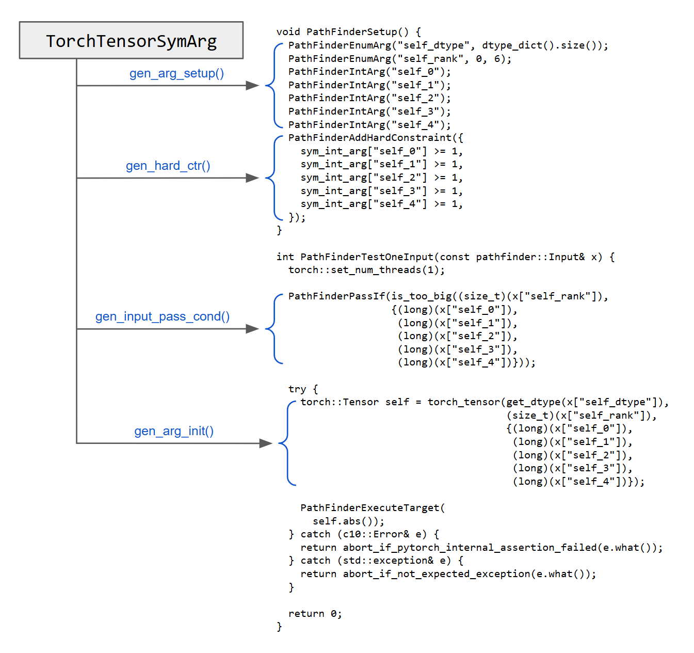

# PathFinder Driver Generator

The PathFinder Driver Generator (PDG) is a tool that supports PathFinder, the core technique presented in the ICSE 2025 paper, *Lightweight Concolic Testing via Path-Condition Synthesis for Deep Learning Libraries*. PDG automatically generates test drivers, which are code snippets required for running PathFinder.

You may also be interested in:

- [PathFinder](https://github.com/starlab-unist/pathfinder), the fuzzing tool that implements the technique presented in the paper.
- [PathFinder-artifact](https://github.com/starlab-unist/pathfinder-artifact), the artifact for the paper. It provides concrete examples of setting up and running PathFinder for testing DL libraries (PyTorch and TensorFlow).

    > **NOTE**
    >
    > If you are interested in running PathFinder for PyTorch or TensorFlow, This is the right place.

## 1. Setup

### 1.1. Pre-built Docker Image

You can directly pull pre-built PathFinder image, by

```bash
docker pull starlabunist/pathfinder:base
# PDG home path = /root/pathfinder-driver-generator
```

### 1.2. Build from Source

Following instructions are based on an Ubuntu 22.04 environment.

#### 1.2.1. Install Prerequisites

- Clang
    ```bash
    apt-get update && apt-get install -y clang
    ```

#### 1.2.2. Build PDG

- Build

  ```bash
  git clone https://github.com/starlab-unist/pathfinder-driver-generator.git \
      $HOME/pathfinder-driver-generator
  cd $HOME/pathfinder-driver-generator && mkdir build && cd build
  CC=clang CXX=clang++ cmake -GNinja -DCMAKE_BUILD_TYPE=Debug ..
  ninja
  ```

## 2. Usage

> **NOTE**
>
> PDG interacts with PathFinder-artifact by generating test drivers and PoVs (proof of vulnerabilities) dynamically. For more advanced usage examples, please refer to the [scripts](https://github.com/starlab-unist/pathfinder-artifact/expmanager.py) and [Dockerfiles](https://github.com/starlab-unist/pathfinder-artifact/docker) in PathFinder-artifact.

This section introduces a basic command for generating test driver codes.

```bash
$HOME/pathfinder-driver-generator/build/bin/pdg --dll torch --dll_version 2.2 --output ./pdg-output
```
- Result will be stored in `./pdg-output`.
- Useful Flags
  - `--dll`: Target DL library. Should be one of {`torch`, `tf`}.
  - `--dll_version`: Version of target DLL. Possible values are {`1.11`, `2.2`} for `torch` and {`2.16`} for `tf`.
  - `--output`: Output dir path. If not specified, set to cwd.

## 3. How to Extend to other DL Libraries

PDG generates test drivers from the parameter type information of the API. The figure below shows an example test driver for the PyTorch API `torch::Tensor::abs()`. PDG generates a `TorchTensorSymArg` object corresponding to the tensor parameter `self` and uses it to produce the test driver code. (A corresponding example for TensorFlow can be found at [TFTensorSymArg.png](./img/TFTensorSymArg.png).)



PDG is implemented in a **generic** manner to enable code generation logic reuse. As a result, there is no need to implement separate code generators for each DL library; only library-specific components need to be added. The components required to extend PDG to a new DL library are as follows:

1. **API signature information** and **parser**:
    - The API signature, which includes parameter type information, must be provided. Additionally, a parser to process this information and convert it into `SymArg` objects must be implemented. Examples can be found in the [api-signatures](./api-signatures) directory and {[tf_parser.cpp](./src/tf_opdef.cpp), [torch_gen.cpp](./src/torch_gen.cpp)}, respectively.

      > **NOTE**
      >
      > The approach for obtaining API signature information varies across DL libraries. For PyTorch, it can be retrieved from the source code using an [LLVM-based tool](https://github.com/starlab-unist/torch-api-sig-extractor), while for TensorFlow, it can be obtained by calling the [OpRegistry function](https://github.com/tensorflow/tensorflow/blob/56dadbbf1787f9c54c42c690879ac35d133d0bd0/tensorflow/core/framework/op.h#L91).

1. **Inheriting** and **Overriding** PDG's base classes:

    - You need to inherit the base classes of PDG responsible for code generation and override their methods. The relevant base classes can be found in [symarg.h](./src/symarg.h), [api.h](./src/api.h), and [generator.h](./src/generator.h). Corresponding examples for PyTorch and TensorFlow are available in `*_symarg.{h,cpp}`, `*_api.{h,cpp}`, and `*_generator.{h,cpp}`.

1. (Optional) **Template** dir and files for build:

    - To streamline the test driver build process following code generation, you can provide a template that is consistent with the build system (e.g., [CMake](https://cmake.org/) or [Bazel](https://bazel.build/)) of the target DL library. Examples of these templates are available in the [template](./template/) directory.
